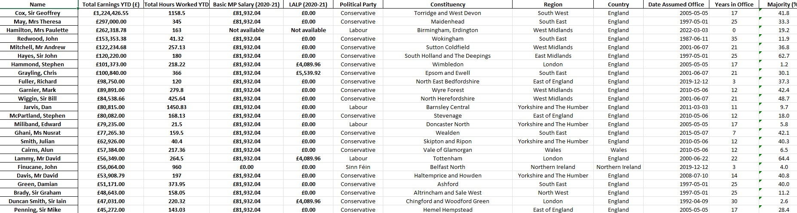
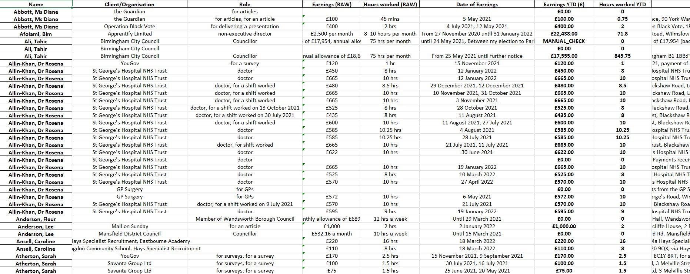
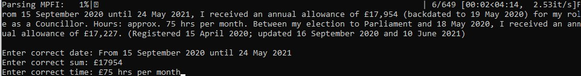

# MP Second Jobs Scanner

__Ever wanted to know how much your MP is earning per year on top of their £81K+* parliamentary salary? And from who? What about the number of hours they spend working in those second jobs?__

That information is publicly available in [The Register of Members' Financial Interests](https://publications.parliament.uk/pa/cm/cmregmem/contents2122.htm)... but it doesn't really answer these questions, or any of the questions people really want to know, because it isn't organised to help you do that. 

The MP Second Jobs Scanner was built so these questions can be easily answered and, more generally, to parse the wordy and disconnected information in the Register into something more useful to everyone. It turns Register entries for all 650 Members of Parliament into structured and searchable spreadsheets.

With the data produced by the Scanner you can now, at a quick glance, see how much your local MP has earned in the last year from secondary sources of income, check how many hours they've worked, who they've been working for, or whatever else you might be interested in. You can also compare MPs and filter by fields such as their political party, geography, years in office, and their % majority.

This resource is open-source and free to use for members of the public, journalists, data scientists, researchers, and whoever else might be interested. **I would love to hear what it's being used for! Drop me a quick email at andrew@andrewkmessios.com and tell me about it :)**

_*As of April 2022, MPs now earn £84,411 per year, compared to £81,932 in 2020-21. The scanner uses the 2020-21 salary for now as IPSA hasn't updated to the new salary range._

## The data

The Scanner uses machine-learning with custom-trained [NER](https://monkeylearn.com/blog/named-entity-recognition/) models to extract structured data from the Register, which is updated every two weeks. It also pulls information from other sources such as IPSA, ParallelParliament, and DBpedia. 

The data is exported as excel spreadsheets saved in the **/excel** folder. Each spreadsheet is named after the corresponding date of the Register entry _e.g._ 3rd of May 2022 = 220503.xlsx 

**_NB: While the Scanner works perfectly most of the time, it will on occasion miss or miscategorise data resulting in errors. If something looks off, it might well be. Please do some due dilligence and double-check the data yourself against the original source. And if there are any glaring errors, please let me know._**

## Running the Scanner yourself

If you want to run the Scanner yourself, go for it. It's pretty easy. While it works well, sometimes it does hit a bug which you might have to go and fix. I do this myself for the final spreadsheets in the **/excel** folder but if you want to do the scraping then you'll have to! Feel free to get in touch if you have any questions about it.

* First, find the date of the Register you wish to scrape from [this page](https://publications.parliament.uk/pa/cm/cmregmem/contents2122.htm).

* Second, clone this git repo and then run from the command line:

        C:\git-repo> python3 main.py "short-date" "long-date"

    _long-date_ takes the date written as DD MMMM YYYY e.g. "3 May 2022" 
    _short-date_ takes the date written as YYMMDD e.g. "220503"

    For example:

        C:\git-repo> python3 main.py "220503" "3 May 2022"

    ...will scrape the Register entry for the [3rd of May 2022](https://publications.parliament.uk/pa/cm/cmregmem/220503/contents.htm) and create a new spreadsheet 220503.xlsx saved in **/excel**.

* Third, keep an eye on the scanner as it's running on the command line. Sometimes it'll hit a line from the Register it doesn't fully understand and you'll have to enter the date, sum, and time values yourself.

    

## Files & Folders

**main.py** main scrapers and scripts

**training.py** script for training new data for custom spaCy NER models

**/excel** spreadsheets named by date of the corresponding Register entry (YYMMDD.xlsx)

**/ner_models** custom NER models managed by git LFS

**/pkl** pkl files managed by git LFS (_NB:_ only permanent pkl files are included here, although others are created by running the MPFI scraper)

**/training** raw training data created with training.py, used to train custom NER models

## Contact

If you have any suggestions or questions please feel free to contact me - **andrew@andrewkmessios.com**